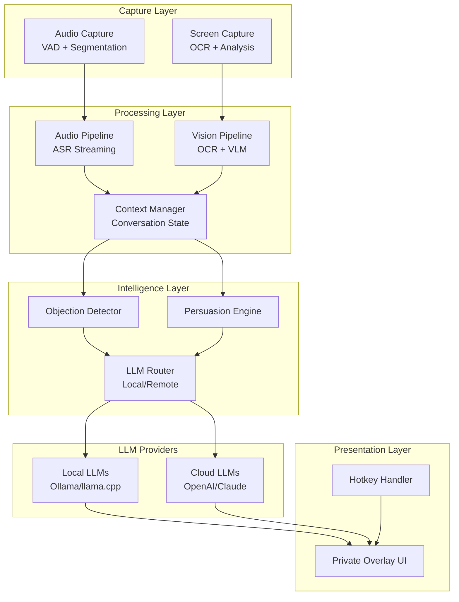
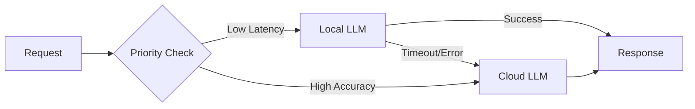
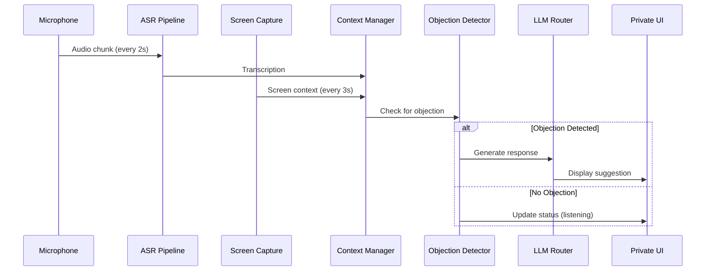

# Arquitetura Técnica - Sistema de Copiloto Cognitivo em Tempo Real

> [!IMPORTANT]
> Este documento especifica a arquitetura técnica de um sistema de assistência cognitiva em tempo real, multimodal, com suporte a LLMs locais e pagos. Foco em engenharia, não marketing.

---

## 1. VISÃO GERAL DA ARQUITETURA

### 1.1 Princípios Arquiteturais

- **Event-Driven Architecture (EDA)**: Componentes desacoplados comunicando-se via eventos
- **Pipeline Assíncrono**: Processamento paralelo de áudio, tela e inferência
- **Backpressure Handling**: Gestão de fluxo para evitar sobrecarga
- **Fallback Strategy**: Degradação graciosa quando LLM local falhar
- **Zero-Trust Privacy**: Dados processados localmente, sem persistência padrão

### 1.2 Diagrama de Alto Nível



---

## 2. COMPONENTES PRINCIPAIS

### 2.1 Audio Capture Module

**Responsabilidade**: Capturar apenas áudio do microfone do usuário, segmentar em chunks processáveis.

**Tecnologias**:
- **Windows**: WASAPI (Windows Audio Session API) - captura loopback excluída
- **PortAudio**: Cross-platform, baixa latência
- **WebRTC VAD**: Voice Activity Detection
- **Silero VAD**: Mais preciso, baseado em NN

**Fluxo**:
1. Captura contínua do microfone (16kHz, mono)
2. VAD detecta início/fim de fala
3. Segmentação em janelas de 2-5s com overlap de 0.5s
4. Buffer circular para evitar perda de dados

**Especificações**:
```
Sample Rate: 16000 Hz
Channels: 1 (mono)
Format: PCM 16-bit
Buffer Size: 512 samples (~32ms latência)
VAD Threshold: 0.5 (ajustável)
Min Speech Duration: 300ms
Max Speech Gap: 800ms
```

**Desafios**:
- **Eco do sistema**: Garantir que áudio do Zoom/Meet não seja capturado
  - **Solução**: Captura exclusiva de dispositivo de entrada, não loopback
- **Ruído de fundo**: Reuniões com múltiplas fontes sonoras
  - **Solução**: Noise suppression (RNNoise, Krisp.ai SDK)

---

### 2.2 Screen Capture Module

**Responsabilidade**: Capturar tela local periodicamente, extrair texto e contexto visual, sem aparecer em compartilhamentos.

**Tecnologias**:
- **Windows**: DXGI Desktop Duplication API (não capturado por OBS/Zoom)
- **GDI+**: Fallback para compatibilidade
- **Tesseract OCR**: Extração de texto
- **GPT-4V/LLaVA**: Análise semântica de imagens (opcional)

**Fluxo**:
1. Captura de tela a cada 2-5s (configurável)
2. Detecção de mudanças (pixel diff > 15%)
3. Se mudança detectada:
   - OCR em regiões de texto
   - Detecção de slides (layout analysis)
   - Extração de elementos-chave (títulos, números, gráficos)
4. Hash de conteúdo para evitar reprocessamento

**Especificações**:
```
Capture Interval: 3s (adaptativo)
Capture Method: DXGI Duplication
OCR Engine: Tesseract 5.x
OCR Languages: pt, en, es
Image Preprocessing: Grayscale, contrast enhancement
Change Detection Threshold: 15% pixel diff
Max Resolution: 1920x1080 (downscale se maior)
Compression: PNG (lossless para OCR)
```

**Privacidade**:
- Captura via DXGI não aparece em:
  - OBS Studio
  - Zoom screen share
  - Teams screen share
  - Google Meet screen share
- Confirmado por isolamento de camadas gráficas do Windows

**Desafios**:
- **Performance**: Captura + OCR pode consumir CPU
  - **Solução**: Processamento em thread separada, throttling adaptativo
- **Slides com gráficos**: OCR não captura informações visuais
  - **Solução**: Integração opcional com Vision-Language Models (VLM)

---

### 2.3 ASR (Automatic Speech Recognition) Pipeline

**Responsabilidade**: Transcrever áudio em tempo real com baixa latência.

**Tecnologias (Opções)**:

| Engine | Latência | Precisão | Offline | Custo |
|--------|----------|----------|---------|-------|
| **Whisper (OpenAI)** | 500ms-2s | Alta | ✅ | Grátis |
| **Faster Whisper** | 200-800ms | Alta | ✅ | Grátis |
| **WhisperLive** | 100-300ms | Média | ✅ | Grátis |
| **Deepgram** | 50-150ms | Alta | ❌ | $$ |
| **AssemblyAI** | 100-200ms | Alta | ❌ | $$ |
| **Azure Speech** | 100-300ms | Alta | ❌ | $$ |

**Recomendação**: 
- **Produção**: Faster Whisper (local) + Deepgram (fallback)
- **Custo-benefício**: WhisperLive para streaming real

**Fluxo**:
1. Receber chunk de áudio do Audio Capture
2. Normalização de áudio (loudness, noise gate)
3. Envio para ASR engine
4. Recebimento de transcrição parcial (streaming)
5. Detecção de fim de sentença
6. Envio para Context Manager

**Especificações**:
```
Model: faster-whisper-large-v3
Beam Size: 5
Language: auto-detect (pt, en, es priority)
VAD Filter: True
Condition on Previous Text: True (context)
Word Timestamps: True
Hallucination Filtering: True
```

**Detecção Semântica**:
- **Perguntas**: Regex + NLP (spaCy)
  - Padrões: `"como.*?", "qual.*?", "por que.*?", "quando.*?"`
- **Objeções**: Classificador treinado (fine-tuned BERT)
  - Classes: preço, autoridade, confiança, prioridade, risco, comparação
- **Hesitação**: Análise de pausa + palavras de preenchimento ("ééé", "então", "tipo")

---

### 2.4 Vision Pipeline

**Responsabilidade**: Processar imagens da tela, extrair texto e contexto semântico.

**Componentes**:
1. **OCR Engine (Tesseract)**:
   - Extração de texto bruto
   - Bounding boxes para layout
2. **Layout Analyzer**:
   - Detecção de slides (bordas, fundos)
   - Hierarquia de texto (títulos, corpo, rodapé)
3. **VLM (Opcional - GPT-4V, LLaVA)**:
   - Descrição de gráficos
   - Análise de diagramas
   - Extração de informações não textuais

**Fluxo**:
```
Screenshot → Preprocessing → OCR → Layout Analysis → Context Extraction
                                 ↓
                          (Optional) VLM Analysis
```

**Output**:
```json
{
  "timestamp": "2024-01-15T10:30:45Z",
  "content_hash": "a3f5b...",
  "text": "Aumento de 35% em vendas Q4...",
  "layout": {
    "slide_number": 12,
    "title": "Resultados Financeiros",
    "key_points": ["35% crescimento", "ROI de 2.3x"],
    "visual_elements": ["bar_chart", "logo"]
  },
  "change_detected": true
}
```

---

### 2.5 Context Manager

**Responsabilidade**: Manter estado conversacional, histórico, contexto visual, perfil do usuário.

**Estrutura de Dados**:
```typescript
interface ConversationContext {
  session_id: string;
  user_profile: UserProfile;
  conversation_history: Message[];
  current_screen: ScreenContext | null;
  objections_detected: Objection[];
  sentiment_timeline: SentimentPoint[];
  metadata: {
    scenario_type: "sales" | "pitch" | "interview" | "meeting";
    start_time: Date;
    participants_count: number;
  };
}

interface Message {
  id: string;
  timestamp: Date;
  speaker: "user" | "other";
  text: string;
  confidence: number;
  detected_intent: "question" | "objection" | "agreement" | "neutral";
  objection_type?: ObjectionType;
}

interface ScreenContext {
  timestamp: Date;
  slide_number?: number;
  extracted_text: string;
  key_entities: string[];
  visual_summary: string;
}
```

**Sliding Window**:
- Últimas 10 mensagens (ou últimos 3 minutos)
- Compressão de histórico antigo via sumarização
- Retenção de objeções importantes

**Persistência**:
- **Memória volátil** (RAM): Sessão ativa
- **Disco** (opcional): Histórico criptografado (AES-256)
- **Nuvem**: Nunca, exceto se explicitamente configurado

---

### 2.6 Objection Detector

**Responsabilidade**: Classificar objeções em tempo real e extrair contexto.

**Modelo de Classificação**:
- **Base**: DistilBERT fine-tuned em dataset de vendas
- **Classes**:
  1. **Preço**: "muito caro", "fora do orçamento"
  2. **Autoridade**: "preciso falar com meu chefe"
  3. **Confiança**: "não conheço sua empresa"
  4. **Prioridade**: "não é urgente agora"
  5. **Risco**: "e se não funcionar?"
  6. **Comparação**: "concorrente X oferece Y"
  7. **none**: Não é objeção

**Pipeline**:
```
Transcription → Tokenization → Embedding → Classification → Confidence Score
```

**Output**:
```json
{
  "objection_detected": true,
  "type": "price",
  "confidence": 0.87,
  "original_text": "o valor está acima do que planejamos",
  "suggested_strategy": "reframing_value"
}
```

**Fallback**: Se modelo local falhar, regex patterns básicos.

---

### 2.7 Persuasion Engine

**Responsabilidade**: Gerar respostas persuasivas curtas, naturais, acionáveis.

**Estratégias de Persuasão** (Baseadas em Cialdini + Sales Engineering):

| Tipo de Objeção | Estratégia | Exemplo de Prompt |
|-----------------|------------|-------------------|
| Preço | Reframing (valor vs custo) | "Em vez de custo, mostre ROI em 6 meses" |
| Autoridade | Facilitação de decisão | "Posso enviar um sumário executivo?" |
| Confiança | Prova social + cases | "Cliente similar obteve X resultado" |
| Prioridade | Urgência + FOMO | "Promoção termina essa semana" |
| Risco | Garantias + trial | "Oferecemos garantia de 30 dias" |
| Comparação | Diferenciação | "Nosso diferencial é X, que eles não têm" |

**Geração de Resposta**:
```python
def generate_persuasion_response(
    objection: Objection,
    context: ConversationContext,
    screen_content: ScreenContext
) -> Response:
    """
    Gera resposta persuasiva usando LLM.
    """
    prompt = build_prompt(
        objection_type=objection.type,
        conversation_history=context.get_recent_messages(n=5),
        screen_summary=screen_content.visual_summary,
        user_goal=context.user_profile.goal,
        tone=context.user_profile.communication_style
    )
    
    llm_response = llm_router.generate(
        prompt=prompt,
        max_tokens=50,  # Respostas curtas
        temperature=0.7,
        stop_sequences=["\n\n", "User:", "Assistant:"]
    )
    
    return Response(
        text=llm_response.text,
        confidence=llm_response.confidence,
        strategy=objection.suggested_strategy,
        alternatives=[...]  # Opções secundárias
    )
```

**Constraints de Output**:
- Máximo 3 frases
- Linguagem falada (contraído, natural)
- Tom ajustável: confiante, técnico, empático, assertivo
- Evitar jargões excessivos

---

### 2.8 LLM Router

**Responsabilidade**: Orquestrar chamadas para LLMs locais ou pagos, com fallback inteligente.

**Arquitetura**:


**Estratégia de Seleção**:
1. **Padrão**: LLM local (latência < 500ms)
2. **Fallback**: LLM pago se:
   - Local timeout (>2s)
   - Local retorna resposta incoerente
   - Detecção de caso complexo (múltiplas objeções, contexto extenso)

**Configuração**:
```yaml
llm_router:
  default_provider: local
  
  local:
    engine: ollama
    model: llama3.1:8b-instruct-q4_K_M
    endpoint: http://localhost:11434
    timeout: 2000ms
    max_tokens: 150
    temperature: 0.7
    
  cloud:
    primary:
      provider: anthropic
      model: claude-3-haiku-20240307
      api_key: ${ANTHROPIC_API_KEY}
      timeout: 5000ms
      max_tokens: 150
      
    secondary:
      provider: openai
      model: gpt-4o-mini
      api_key: ${OPENAI_API_KEY}
      
  fallback_strategy:
    - local → cloud.primary
    - cloud.primary → cloud.secondary
    - cloud.secondary → cached_response
```

**Prompt Compatibility**:
- Templates unificados (Jinja2)
- Adaptação automática para formato de cada provider:
  - OpenAI: `messages` array
  - Anthropic: `human`/`assistant` tags
  - Ollama: `prompt` string

**Exemplo de Template**:
```jinja2
You are a sales assistant providing real-time suggestions.

Context:
- Scenario: {{ scenario_type }}
- Current slide: {{ screen_context.title }}
- Recent conversation:

  - {{ msg.speaker }}: {{ msg.text }}


Objection detected: "{{ objection.text }}" (type: {{ objection.type }})

Provide a short, natural response (max 2 sentences) using {{ strategy }} strategy.
```

---

### 2.9 Private Overlay UI

**Responsabilidade**: Exibir sugestões de forma privada, sem captura por screen sharing.

**Tecnologia**:
- **Electron** (cross-platform)
- **WPF** (Windows nativo, melhor performance)
- **Qt** (alternativa cross-platform)

**Características**:
1. **Overlay Window**:
   - Sempre no topo
   - Transparência configurável
   - Clicável ou não (toggle)
2. **Isolamento Visual**:
   - Window attributes: `WS_EX_LAYERED`, `WS_EX_TRANSPARENT` (Windows)
   - Exclusão de captura: `SetWindowDisplayAffinity(hwnd, WDA_EXCLUDEFROMCAPTURE)`
3. **Posicionamento**:
   - Canto inferior direito (padrão)
   - Arrastável
   - Minimizável (hotkey)

**Layout**:
```
┌─────────────────────────────────────┐
│ 💡 Sugestão Principal               │
│ "Que tal mencionar o case da IBM?" │
│                                     │
│ ⚡ Alternativa                      │
│ "Podemos oferecer ROI em 6 meses"  │
│                                     │
│ [Confiança: 87%] [Esc p/ fechar]  │
└─────────────────────────────────────┘
```

**Hotkeys**:
- `Ctrl+Shift+A`: Toggle visibilidade
- `Ctrl+Shift+R`: Refresh sugestão
- `Esc`: Fechar temporariamente
- `Ctrl+Shift+C`: Copiar sugestão principal

---

## 3. FLUXO DE DADOS E TIMING

### 3.1 Pipeline Completo (Latência Target)

```
Audio Capture (32ms)
  ↓
VAD Detection (10ms)
  ↓
ASR Streaming (200-800ms)
  ↓
Context Update (5ms)
  ↓
Objection Detection (20ms)
  ↓
Parallel: Screen Analysis (100ms) | LLM Inference (300-2000ms)
  ↓
Response Formatting (10ms)
  ↓
UI Update (16ms)
─────────────────────────────────────
Total: ~400-3000ms (target: <500ms com local LLM)
```

### 3.2 Event Flow



---

## 4. INTEGRAÇÃO LOCAL vs CLOUD LLMs

### 4.1 LLMs Locais

**Engines Suportados**:

1. **Ollama**:
   - Mais fácil de usar
   - API REST
   - Download automático de modelos
   - Recomendação: **Primeiro lugar**

2. **llama.cpp**:
   - Mais performático
   - Suporte a quantização agressiva
   - CLI/Python bindings
   - Recomendação: **Segundo lugar**

3. **LM Studio**:
   - Interface gráfica
   - API OpenAI-compatible
   - Bom para usuários não-técnicos

**Modelos Recomendados** (latência vs qualidade):

| Modelo | Tamanho | RAM | Latência (RTX 3060) | Qualidade |
|--------|---------|-----|---------------------|-----------|
| Phi-3-mini-4k | 3.8B | 4GB | ~100ms | Média |
| Llama-3.2-3B | 3B | 4GB | ~120ms | Boa |
| Mistral-7B-Instruct-v0.2 | 7B | 8GB | ~300ms | Alta |
| Llama-3.1-8B-Instruct | 8B | 10GB | ~350ms | Alta |
| Qwen2.5-7B-Instruct | 7B | 8GB | ~280ms | Alta |

**Quantização**:
- Q4_K_M: Melhor custo-benefício (4-bit)
- Q5_K_M: +10% qualidade, +30% latência
- Q8_0: Próximo de FP16, 2x latência

**Setup Example (Ollama)**:
```bash
# Instalar Ollama
curl -fsSL https://ollama.com/install.sh | sh

# Download modelo
ollama pull llama3.1:8b-instruct-q4_K_M

# Iniciar servidor
ollama serve
```

**API Call**:
```python
import requests

def query_ollama(prompt: str) -> str:
    response = requests.post(
        "http://localhost:11434/api/generate",
        json={
            "model": "llama3.1:8b-instruct-q4_K_M",
            "prompt": prompt,
            "stream": False,
            "options": {
                "temperature": 0.7,
                "num_predict": 150,
                "stop": ["\n\n", "User:"]
            }
        },
        timeout=2.0
    )
    return response.json()["response"]
```

### 4.2 LLMs Pagos

**Providers Suportados**:

1. **Anthropic (Claude)**:
   - Melhor para raciocínio complexo
   - Modelo: `claude-3-haiku-20240307` (rápido, barato)
   - Latência: ~500-1500ms
   - Custo: $0.25/MTok input, $1.25/MTok output

2. **OpenAI (GPT)**:
   - Mais popular
   - Modelo: `gpt-4o-mini` (barato) ou `gpt-4o` (preciso)
   - Latência: ~800-2000ms
   - Custo: $0.15/MTok input, $0.60/MTok output (mini)

3. **Google (Gemini)**:
   - Boa integração multimodal
   - Modelo: `gemini-1.5-flash`
   - Latência: ~600-1800ms
   - Custo: $0.075/MTok input, $0.30/MTok output

**API Example (OpenAI)**:
```python
from openai import OpenAI

client = OpenAI(api_key=os.environ["OPENAI_API_KEY"])

def query_openai(messages: list) -> str:
    response = client.chat.completions.create(
        model="gpt-4o-mini",
        messages=messages,
        max_tokens=150,
        temperature=0.7,
        timeout=5.0
    )
    return response.choices[0].message.content
```

### 4.3 Hybrid Strategy

**Decision Tree**:
```python
def select_llm_provider(request: Request) -> LLMProvider:
    """
    Seleciona provider baseado em contexto.
    """
    # Prioridade 1: Latência
    if request.requires_low_latency:
        return LocalLLM()
    
    # Prioridade 2: Complexidade
    if request.complexity_score > 0.7:
        return CloudLLM(provider="anthropic")
    
    # Prioridade 3: Custo
    if user_config.minimize_cost:
        return LocalLLM()
    
    # Default
    return LocalLLM()
```

**Fallback com Circuit Breaker**:
```python
class CircuitBreaker:
    def __init__(self, failure_threshold=5, timeout=60):
        self.failure_count = 0
        self.failure_threshold = failure_threshold
        self.timeout = timeout
        self.last_failure_time = None
        self.state = "closed"  # closed, open, half-open
    
    def call(self, func, *args, **kwargs):
        if self.state == "open":
            if time.time() - self.last_failure_time > self.timeout:
                self.state = "half-open"
            else:
                raise Exception("Circuit breaker is open")
        
        try:
            result = func(*args, **kwargs)
            if self.state == "half-open":
                self.state = "closed"
                self.failure_count = 0
            return result
        except Exception as e:
            self.failure_count += 1
            self.last_failure_time = time.time()
            if self.failure_count >= self.failure_threshold:
                self.state = "open"
            raise e
```

---

## 5. STACK TECNOLÓGICO RECOMENDADO

### 5.1 Linguagens

**Backend/Core**:
- **Python 3.11+**: Pipeline principal, ML, ASR
  - Asyncio para concorrência
  - Fast, type hints
- **Rust** (opcional): Componentes críticos de performance (VAD, audio processing)
- **C++** (opcional): Integração com llama.cpp

**UI**:
- **TypeScript + Electron**: Cross-platform overlay
- **C# + WPF**: Windows nativo (melhor exclusão de captura)

### 5.2 Frameworks e Bibliotecas

**Audio**:
- `pyaudio` / `sounddevice`: Captura de áudio
- `webrtcvad`: Voice Activity Detection
- `noisereduce`: Redução de ruído
- `pydub`: Manipulação de áudio

**ASR**:
- `faster-whisper`: Whisper otimizado (CTranslate2)
- `deepgram-sdk`: API para Deepgram (se cloud)
- `whisper-live`: Streaming real-time

**NLP**:
- `transformers` (HuggingFace): Modelos de classificação
- `spacy`: NER, parsing
- `sentence-transformers`: Embeddings

**Vision**:
- `pytesseract`: OCR
- `opencv-python`: Processamento de imagem
- `Pillow`: Manipulação de imagem
- `playwright` (optional): Automação para testes

**Screen Capture**:
- `mss`: Multi-platform screenshot
- `pywin32`: Windows API (DXGI)
- `python-xlib`: Linux (X11)

**LLM**:
- `ollama-python`: Cliente Ollama
- `llama-cpp-python`: Bindings llama.cpp
- `openai`: Cliente OpenAI
- `anthropic`: Cliente Anthropic

**UI**:
- `PyQt6` / `PySide6`: UI Python-native
- Electron + React: Web-based overlay

**Infra**:
- `fastapi`: API REST (se necessário)
- `redis`: Cache de respostas (opcional)
- `sqlite`: Persistência local
- `python-dotenv`: Configuração

### 5.3 Arquitetura de Código (Python)

```
project/
├── src/
│   ├── capture/
│   │   ├── audio_capture.py       # Audio input
│   │   ├── screen_capture.py      # Screen capture
│   │   └── vad.py                 # Voice Activity Detection
│   ├── processing/
│   │   ├── asr_pipeline.py        # Speech-to-text
│   │   ├── vision_pipeline.py     # OCR + analysis
│   │   └── context_manager.py     # State management
│   ├── intelligence/
│   │   ├── objection_detector.py  # Classify objections
│   │   ├── persuasion_engine.py   # Generate responses
│   │   └── llm_router.py          # LLM orchestration
│   ├── llm/
│   │   ├── local_provider.py      # Ollama/llama.cpp
│   │   ├── cloud_provider.py      # OpenAI/Claude
│   │   └── prompt_templates.py    # Prompt management
│   ├── ui/
│   │   ├── overlay.py             # Main UI
│   │   └── hotkeys.py             # Keyboard shortcuts
│   ├── config/
│   │   └── settings.py            # Configuration
│   └── main.py                    # Entry point
├── models/
│   └── objection_classifier/      # Fine-tuned models
├── tests/
├── requirements.txt
└── README.md
```

---

## 6. PRIVACY & SECURITY

### 6.1 Princípios

1. **Zero Persistence (Default)**: Nada gravado em disco exceto configuração
2. **Local-First**: Processamento na máquina do usuário
3. **Encryption**: Dados em trânsito (HTTPS) e repouso (AES-256)
4. **Ephemeral**: RAM limpa ao encerrar sessão
5. **Consent**: Gravação/upload apenas com opt-in explícito

### 6.2 Implementação

**Captura Privada**:
```python
# Windows API para excluir janela de captura
import ctypes

WDA_EXCLUDEFROMCAPTURE = 0x00000011

def make_window_private(hwnd):
    """Impede que janela seja capturada por screen sharing."""
    ctypes.windll.user32.SetWindowDisplayAffinity(
        hwnd, 
        WDA_EXCLUDEFROMCAPTURE
    )
```

**Dados em Memória**:
```python
import mmap

class SecureMemory:
    """Aloca memória que será zerada ao desalocar."""
    
    def __init__(self, size):
        self.size = size
        self.buffer = mmap.mmap(-1, size)
    
    def write(self, data: bytes):
        self.buffer.write(data)
    
    def read(self) -> bytes:
        self.buffer.seek(0)
        return self.buffer.read()
    
    def __del__(self):
        # Zera memória antes de desalocar
        self.buffer.seek(0)
        self.buffer.write(b'\x00' * self.size)
        self.buffer.close()
```

**Opt-in para Persistência**:
```python
class SessionRecorder:
    def __init__(self, consent: bool = False):
        self.consent = consent
        self.encrypted_storage = None
        
        if consent:
            self.encrypted_storage = EncryptedDB(
                path="sessions.db",
                key=derive_key_from_password(user_password)
            )
    
    def save_message(self, message: Message):
        if not self.consent:
            return  # No-op
        
        self.encrypted_storage.insert(message)
```

### 6.3 Compliance

**GDPR/LGPD**:
- Right to erasure: Comando para apagar todos os dados
- Data minimization: Apenas o necessário processado
- Consent: Opt-in explícito para gravação
- Transparency: Logs de processamento disponíveis

**Enterprise**:
- Audit logs (opcional, criptografado)
- Compliance mode: Desativa cloud LLMs
- Air-gapped mode: Apenas LLMs locais

---

## 7. PERFORMANCE & OPTIMIZATION

### 7.1 Targets

| Métrica | Target | Aceitável | Crítico |
|---------|--------|-----------|---------|
| End-to-end latency | <500ms | <1000ms | <2000ms |
| CPU usage (idle) | <5% | <10% | <20% |
| CPU usage (active) | <30% | <50% | <70% |
| RAM usage | <2GB | <4GB | <8GB |
| GPU usage (w/ local LLM) | <50% | <80% | <100% |

### 7.2 Otimizações

**Audio Pipeline**:
- Processar em thread separada (GIL bypass com Cython/Rust)
- Buffer circular lock-free
- VAD em C++ (WebRTC) vs Python (Silero)

**ASR**:
- Faster Whisper com CTranslate2 (2-4x speedup vs Whisper base)
- Quantização INT8 (2x speedup, -5% accuracy)
- Batching (se múltiplos usuários)

**LLM Inference**:
- **Local**: GPU sempre (CUDA/Metal)
- Quantização Q4_K_M (4x menor, 1.5x mais rápido)
- KV cache habilitado
- Continuous batching (vLLM, se servidor)

**Screen Capture**:
- Throttling adaptativo (captura só se mudança >15%)
- Downscale para OCR (máx 1920x1080)
- OCR incremental (só regiões alteradas)

**Context Manager**:
- Sliding window (últimos 10 msgs)
- Sumarização de histórico antigo (background task)
- Embeddings cachados (evita reprocessamento)

### 7.3 Profiling

```python
import cProfile
import pstats

def profile_pipeline():
    profiler = cProfile.Profile()
    profiler.enable()
    
    # Simular fluxo completo
    run_end_to_end_test()
    
    profiler.disable()
    stats = pstats.Stats(profiler)
    stats.sort_stats('cumulative')
    stats.print_stats(20)  # Top 20 funções
```

**Bottlenecks Esperados**:
1. ASR inference (60-80% do tempo)
2. LLM inference (se local, 70-90%)
3. OCR (se tela complexa, 10-20%)

**Soluções**:
- ASR: Faster Whisper + GPU
- LLM: Quantização + GPU + modelo menor
- OCR: Caching + processamento incremental

---

## 8. INTEGRAÇÃO COM VIDEOCONFERÊNCIAS

### 8.1 Estratégia Passiva

**Princípio**: Sistema não interage diretamente com Zoom/Meet/Teams, apenas captura áudio/tela local.

**Vantagens**:
- Sem necessidade de API de terceiros
- Funciona com qualquer plataforma
- Menor risco de detecção

**Desvantagens**:
- Não distingue speakers automaticamente
- Não acessa metadata de reunião

### 8.2 Isolamento de Áudio

**Problema**: Evitar capturar áudio do sistema (outros participantes).

**Solução 1: Seleção de Dispositivo**:
```python
import sounddevice as sd

def select_microphone():
    """Lista dispositivos e seleciona apenas microfone."""
    devices = sd.query_devices()
    
    input_devices = [
        d for d in devices 
        if d['max_input_channels'] > 0
    ]
    
    # Usuário seleciona microfone
    print("Dispositivos de entrada:")
    for i, d in enumerate(input_devices):
        print(f"{i}: {d['name']}")
    
    choice = int(input("Escolha: "))
    return input_devices[choice]['index']
```

**Solução 2: Virtual Audio Cable (Avançado)**:
- Instalar VB-Cable ou similar
- Rotear áudio do microfone para app
- Rotear áudio do Zoom para speakers (não app)

### 8.3 Detecção de Speaker (Opcional)

**Problema**: System ASR não sabe quem está falando.

**Solução 1: Heurística**:
- Assumir que usuário fala mais frequentemente
- Usar pausas longas como separador de turno

**Solução 2: Speaker Diarization**:
- `pyannote.audio`: Modelo de diarization
- Treinar em voz do usuário (1min de sample)
- Classificar cada segmento como "user" ou "other"

```python
from pyannote.audio import Pipeline

pipeline = Pipeline.from_pretrained(
    "pyannote/speaker-diarization-3.1"
)

def diarize_audio(audio_path):
    diarization = pipeline(audio_path)
    
    for turn, _, speaker in diarization.itertracks(yield_label=True):
        print(f"{turn.start:.1f}s - {turn.end:.1f}s: {speaker}")
```

**Custo**: +200-500ms latência, +1GB RAM.

---

## 9. DESAFIOS TÉCNICOS E SOLUÇÕES

### 9.1 Latência End-to-End

**Desafio**: Target de <500ms é agressivo.

**Breakdown**:
- Audio capture: 32ms (buffer size)
- VAD: 10ms
- ASR: 200-800ms (Faster Whisper)
- Objection detection: 20ms
- LLM inference: 100-2000ms (local vs cloud)
- UI render: 16ms

**Soluções**:
1. **ASR Streaming**: Não esperar fim da fala, processar parcialmente
2. **LLM Local First**: Usar modelo 3B (Phi-3) para <200ms
3. **Speculative Execution**: Iniciar inferência LLM antes de confirmar objeção
4. **Pre-warming**: Manter LLM em memória (evitar cold start)

**Fallback**: Se latência >1s, marcar visualmente como "Processando..."

### 9.2 Ruído e Ambiente

**Desafio**: Reuniões com eco, múltiplas vozes, ruído de fundo.

**Soluções**:
1. **Noise Suppression**: RNNoise (open-source) ou Krisp SDK
2. **Echo Cancellation**: WebRTC AEC
3. **AGC** (Automatic Gain Control): Normalizar volume
4. **Directional Mic**: Sugerir ao usuário usar headset

**Implementação**:
```python
import noisereduce as nr
import numpy as np

def clean_audio(audio: np.ndarray, sr: int) -> np.ndarray:
    """Remove ruído de áudio."""
    # Noise reduction
    reduced_noise = nr.reduce_noise(
        y=audio, 
        sr=sr,
        stationary=True,
        prop_decrease=0.8
    )
    
    # Normalização
    normalized = reduced_noise / np.max(np.abs(reduced_noise))
    
    return normalized
```

### 9.3 OCR em Slides Complexos

**Desafio**: Gráficos, fontes estilizadas, baixo contraste.

**Soluções**:
1. **Preprocessing**:
   - Grayscale
   - Contrast enhancement (CLAHE)
   - Binarization (Otsu)
2. **Multiple OCR Engines**:
   - Tesseract (padrão)
   - EasyOCR (melhor para fontes estilizadas)
   - PaddleOCR (multilíngue)
3. **VLM Fallback**:
   - Se OCR confidence <70%, enviar para GPT-4V/LLaVA
   - Custo: +500ms, +$0.01 por imagem

**Exemplo**:
```python
import easyocr

reader = easyocr.Reader(['pt', 'en'])

def extract_text_multi_engine(image_path):
    # Tentar Tesseract primeiro (rápido)
    tesseract_result = pytesseract.image_to_string(image_path)
    
    # Se baixa confiança, tentar EasyOCR
    if calculate_confidence(tesseract_result) < 0.7:
        easyocr_result = reader.readtext(image_path)
        return ' '.join([text for _, text, _ in easyocr_result])
    
    return tesseract_result
```

### 9.4 Hallucination em LLMs

**Desafio**: LLMs podem gerar respostas incorretas ou fora de contexto.

**Soluções**:
1. **Grounding**: Incluir dados da tela no prompt
   ```
   Based ONLY on this slide content: {screen_text}
   ```
2. **Confidence Threshold**: Só exibir se confidence >0.6
3. **Fact-Checking** (opcional):
   - Verificar se resposta menciona dados do slide
   - Regex para detectar números inventados
4. **Human-in-the-Loop**: Sempre permitir editar sugestão antes de usar

### 9.5 GPU Availability

**Desafio**: Usuário pode não ter GPU ou ter GPU fraca.

**Soluções**:
1. **CPU-Only Mode**:
   - Usar modelos pequenos (Phi-3-mini, 3.8B)
   - Quantização agressiva (Q4_K_M)
   - Latência: 2-5s (aceitável para casos não-críticos)
2. **Cloud Fallback**:
   - Auto-detectar: se latência local >3s, switch para cloud
3. **Precomputed Responses**:
   - Cache de objeções comuns + respostas
   - Retrieve similar + adapt

**Detecção de GPU**:
```python
import torch

def detect_hardware():
    if torch.cuda.is_available():
        return "cuda", torch.cuda.get_device_name(0)
    elif torch.backends.mps.is_available():  # Apple Metal
        return "mps", "Apple Silicon"
    else:
        return "cpu", "CPU-only"

device, device_name = detect_hardware()
print(f"Using: {device_name}")
```

### 9.6 Context Window Limits

**Desafio**: LLMs têm limite de tokens (4k-32k).

**Soluções**:
1. **Sliding Window**: Manter só últimas 10 mensagens (~2k tokens)
2. **Summarization**: Sumarizar histórico antigo
   ```python
   old_history = conversation[:-10]
   summary = llm.summarize(old_history, max_tokens=200)
   context = summary + recent_messages
   ```
3. **Selective Context**: Incluir apenas mensagens com objeções detectadas

---

## 10. DEPLOYMENT & DISTRIBUTION

### 10.1 Packaging

**Windows**:
- **PyInstaller**: Empacotar Python em .exe
- **Inno Setup**: Instalador Windows
- **Incluir**:
  - Modelo Whisper (faster-whisper)
  - Modelo de objeção (se offline)
  - Tesseract OCR binário

**Exemplo PyInstaller**:
```bash
pyinstaller --onefile \
            --windowed \
            --add-data "models:models" \
            --add-binary "tesseract/tesseract.exe:tesseract" \
            --icon "app.ico" \
            main.py
```

**Tamanho Estimado**: 500MB-2GB (com modelos).

### 10.2 Configuration

**Arquivo `.env`**:
```ini
# LLM Configuration
LLM_PROVIDER=local  # local | openai | anthropic | google
OLLAMA_MODEL=llama3.1:8b-instruct-q4_K_M
OPENAI_API_KEY=sk-...
ANTHROPIC_API_KEY=sk-ant-...

# Performance
MAX_LATENCY_MS=1000
USE_GPU=true
ENABLE_CLOUD_FALLBACK=true

# Privacy
SAVE_HISTORY=false
ENCRYPTION_ENABLED=true

# Audio
SAMPLE_RATE=16000
VAD_THRESHOLD=0.5

# Screen
SCREEN_CAPTURE_INTERVAL=3
OCR_LANGUAGES=pt,en
```

### 10.3 Updates

**Auto-Update**:
- Electron: `electron-updater`
- Python: Verificar GitHub releases

**Modelo Updates**:
- Ollama: `ollama pull <model>` automático
- HuggingFace: Download via `transformers` cache

---

## 11. TESTING & VALIDATION

### 11.1 Unit Tests

```python
import pytest
from src.intelligence.objection_detector import ObjectionDetector

def test_objection_detection():
    detector = ObjectionDetector()
    
    # Test price objection
    result = detector.classify("Isso está muito caro para nós")
    assert result.type == "price"
    assert result.confidence > 0.7
    
    # Test non-objection
    result = detector.classify("Entendi, obrigado")
    assert result.type == "none"
```

### 11.2 Integration Tests

```python
async def test_end_to_end_pipeline():
    # Simular áudio
    audio_file = "tests/fixtures/sample_objection.wav"
    
    # Pipeline completo
    pipeline = MainPipeline()
    result = await pipeline.process_audio(audio_file)
    
    # Validar
    assert result.transcription is not None
    assert result.objection_detected == True
    assert len(result.suggestion) < 500  # Máx 500 chars
    assert result.latency_ms < 1000
```

### 11.3 Performance Benchmarks

```python
import time

def benchmark_asr():
    audio_samples = load_test_audios(n=100)
    
    start = time.time()
    for audio in audio_samples:
        asr.transcribe(audio)
    end = time.time()
    
    avg_latency = (end - start) / len(audio_samples)
    print(f"ASR avg latency: {avg_latency*1000:.0f}ms")

benchmark_asr()
# Expected: <300ms per 5s audio
```

### 11.4 User Acceptance Testing

**Cenários**:
1. **Reunião de Vendas**: 30min, 3 objeções esperadas
2. **Pitch de Startup**: 10min, slide deck de 15 slides
3. **Entrevista Técnica**: 45min, perguntas complexas

**Métricas**:
- Accuracy de objeção: >80%
- Relevância de sugestão: >70% (avaliação humana)
- Latência p95: <1s
- Falsos positivos: <10%

---

## 12. ROADMAP & FUTURE ENHANCEMENTS

### 12.1 MVP (3 meses)

- [x] Audio capture + VAD
- [x] ASR (Faster Whisper)
- [x] Basic objection detection
- [x] LLM integration (Ollama + OpenAI)
- [x] Simple overlay UI
- [x] Screen capture + OCR

### 12.2 V1 (6 meses)

- [ ] Advanced objection classifier (fine-tuned)
- [ ] Multi-language support (pt, en, es)
- [ ] Speaker diarization
- [ ] VLM integration (GPT-4V fallback)
- [ ] Encrypted session history
- [ ] Hotkey customization

### 12.3 V2 (12 meses)

- [ ] Real-time sentiment analysis
- [ ] Proactive suggestions (pre-empt objections)
- [ ] Integration with CRM (Salesforce, HubSpot)
- [ ] Team analytics (aggregate insights)
- [ ] Voice cloning (practice mode)
- [ ] Mobile companion app

### 12.4 Enterprise Features

- [ ] SSO/SAML authentication
- [ ] Audit logs + compliance mode
- [ ] Custom model fine-tuning
- [ ] Multi-tenant deployment
- [ ] API for programmatic access

---

## 13. CONCLUSÃO

Este sistema representa um desafio técnico significativo, integrando:
- **Processamento de sinais** (áudio, imagem)
- **Machine learning** (ASR, NLP, VLM)
- **Sistemas distribuídos** (LLM local/cloud)
- **UI/UX** (overlay privado)
- **Segurança** (privacidade, criptografia)

**Riscos Principais**:
1. **Latência**: Dependência de hardware do usuário
2. **Accuracy**: LLMs podem gerar respostas irrelevantes
3. **Privacy**: Percepção de "espionagem" se mal implementado
4. **Integração**: Plataformas de videoconferência podem bloquear

**Mitigações**:
- Foco em LLMs locais para controle de latência
- Human-in-the-loop (usuário sempre revisa)
- Transparência radical sobre dados
- Estratégia passiva de integração

**Viabilidade**: Alta, com stack moderno e hardware adequado (GPU recomendada).

**Diferencial**: Combinação de multimodalidade (áudio + tela) + IA persuasiva em tempo real.

---

**Próximos Passos**:
1. Prototipar pipeline de áudio + ASR
2. Testar latência com diferentes LLMs locais
3. Implementar POC de overlay privado
4. Validar com usuários reais (sales team)
