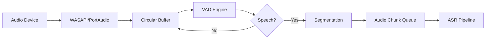

# Especificações Técnicas de Componentes

## 1. AUDIO CAPTURE COMPONENT

### 1.1 Arquitetura Interna



### 1.2 Implementação Detalhada

```python
import sounddevice as sd
import numpy as np
import queue
from collections import deque
from typing import Callable, Optional
import webrtcvad

class AudioCapture:
    """
    Captura áudio do microfone com VAD e segmentação inteligente.
    """
    
    def __init__(
        self,
        sample_rate: int = 16000,
        channels: int = 1,
        chunk_duration_ms: int = 30,
        vad_mode: int = 3,  # 0-3, 3 = mais agressivo
        min_speech_duration_ms: int = 300,
        max_speech_gap_ms: int = 800,
        callback: Optional[Callable] = None
    ):
        self.sample_rate = sample_rate
        self.channels = channels
        self.chunk_duration_ms = chunk_duration_ms
        self.chunk_size = int(sample_rate * chunk_duration_ms / 1000)
        
        # VAD
        self.vad = webrtcvad.Vad(vad_mode)
        self.min_speech_chunks = int(min_speech_duration_ms / chunk_duration_ms)
        self.max_gap_chunks = int(max_speech_gap_ms / chunk_duration_ms)
        
        # State
        self.is_speaking = False
        self.speech_buffer = deque(maxlen=500)  # ~15s @ 30ms chunks
        self.silence_chunks = 0
        self.speech_chunks = 0
        
        # Callback
        self.callback = callback
        
        # Queue para chunks processados
        self.audio_queue = queue.Queue(maxsize=100)
        
    def start(self, device: Optional[int] = None):
        """Inicia captura de áudio."""
        self.stream = sd.InputStream(
            device=device,
            channels=self.channels,
            samplerate=self.sample_rate,
            blocksize=self.chunk_size,
            dtype='int16',
            callback=self._audio_callback
        )
        self.stream.start()
        
    def stop(self):
        """Para captura."""
        if hasattr(self, 'stream'):
            self.stream.stop()
            self.stream.close()
    
    def _audio_callback(self, indata, frames, time_info, status):
        """Callback executado a cada chunk de áudio."""
        if status:
            print(f"Audio callback status: {status}")
        
        # Converter para bytes (VAD espera bytes)
        audio_chunk = indata.copy().tobytes()
        
        # VAD
        is_speech = self._detect_speech(audio_chunk)
        
        # Máquina de estados
        if is_speech:
            self.speech_chunks += 1
            self.silence_chunks = 0
            
            # Adicionar ao buffer
            self.speech_buffer.append(audio_chunk)
            
            if not self.is_speaking and self.speech_chunks >= self.min_speech_chunks:
                # Início de fala detectado
                self.is_speaking = True
                
        else:
            self.silence_chunks += 1
            
            if self.is_speaking:
                # Ainda em fala, adicionar silêncio
                self.speech_buffer.append(audio_chunk)
                
                if self.silence_chunks >= self.max_gap_chunks:
                    # Fim de fala detectado
                    self._process_speech_segment()
                    self.is_speaking = False
                    self.speech_chunks = 0
    
    def _detect_speech(self, audio_chunk: bytes) -> bool:
        """Detecta se chunk contém fala."""
        try:
            return self.vad.is_speech(audio_chunk, self.sample_rate)
        except Exception as e:
            print(f"VAD error: {e}")
            return False
    
    def _process_speech_segment(self):
        """Processa segmento de fala completo."""
        if len(self.speech_buffer) == 0:
            return
        
        # Concatenar chunks
        speech_audio = b''.join(self.speech_buffer)
        
        # Converter para numpy array
        audio_array = np.frombuffer(speech_audio, dtype=np.int16)
        
        # Adicionar à fila
        try:
            self.audio_queue.put_nowait({
                'audio': audio_array,
                'sample_rate': self.sample_rate,
                'timestamp': time.time()
            })
        except queue.Full:
            print("Audio queue full, dropping segment")
        
        # Callback se definido
        if self.callback:
            self.callback(audio_array, self.sample_rate)
        
        # Limpar buffer
        self.speech_buffer.clear()
    
    def get_audio_chunk(self, timeout: float = 1.0):
        """Retorna próximo chunk de áudio da fila."""
        try:
            return self.audio_queue.get(timeout=timeout)
        except queue.Empty:
            return None


# Uso
def on_speech_detected(audio, sample_rate):
    print(f"Speech detected: {len(audio)} samples")

capture = AudioCapture(callback=on_speech_detected)
capture.start()

# Em outro thread/async task
while True:
    chunk = capture.get_audio_chunk()
    if chunk:
        # Enviar para ASR
        transcription = asr_pipeline.transcribe(chunk['audio'])
```

### 1.3 Noise Suppression (Opcional)

```python
import noisereduce as nr

class NoiseReducer:
    """Redução de ruído em tempo real."""
    
    def __init__(self, sample_rate: int = 16000):
        self.sample_rate = sample_rate
        self.noise_profile = None
    
    def calibrate(self, noise_audio: np.ndarray):
        """Calibra com amostra de ruído de fundo."""
        self.noise_profile = noise_audio
    
    def reduce(self, audio: np.ndarray) -> np.ndarray:
        """Aplica redução de ruído."""
        if self.noise_profile is None:
            # Usar redução estatística
            return nr.reduce_noise(
                y=audio,
                sr=self.sample_rate,
                stationary=True,
                prop_decrease=0.8
            )
        else:
            # Usar perfil de ruído
            return nr.reduce_noise(
                y=audio,
                sr=self.sample_rate,
                y_noise=self.noise_profile,
                stationary=False
            )

# Integração
noise_reducer = NoiseReducer()

# Calibração (primeiros 2s de silêncio)
calibration_audio = record_audio(duration=2.0)
noise_reducer.calibrate(calibration_audio)

# Uso
clean_audio = noise_reducer.reduce(noisy_audio)
```

---

## 2. ASR PIPELINE COMPONENT

### 2.1 Faster Whisper Implementation

```python
from faster_whisper import WhisperModel
import numpy as np
from typing import List, Dict, Optional
import time

class ASRPipeline:
    """
    Pipeline de ASR com Faster Whisper.
    """
    
    def __init__(
        self,
        model_size: str = "large-v3",
        device: str = "cuda",  # cuda, cpu
        compute_type: str = "int8",  # int8, float16, float32
        language: Optional[str] = None,  # None = auto-detect
        beam_size: int = 5
    ):
        print(f"Loading Whisper model: {model_size} on {device}")
        self.model = WhisperModel(
            model_size,
            device=device,
            compute_type=compute_type
        )
        self.language = language
        self.beam_size = beam_size
        
    def transcribe(
        self,
        audio: np.ndarray,
        sample_rate: int = 16000,
        return_timestamps: bool = True
    ) -> Dict:
        """
        Transcreve áudio.
        
        Returns:
            {
                'text': str,
                'language': str,
                'segments': List[Dict],
                'confidence': float,
                'latency_ms': float
            }
        """
        start_time = time.time()
        
        # Normalizar áudio (float32, [-1, 1])
        if audio.dtype == np.int16:
            audio = audio.astype(np.float32) / 32768.0
        
        # Transcrição
        segments, info = self.model.transcribe(
            audio,
            language=self.language,
            beam_size=self.beam_size,
            word_timestamps=return_timestamps,
            vad_filter=True,  # Filtrar silêncios
            condition_on_previous_text=True  # Usar contexto
        )
        
        # Processar segmentos
        all_segments = []
        full_text = []
        total_confidence = 0.0
        
        for segment in segments:
            seg_dict = {
                'start': segment.start,
                'end': segment.end,
                'text': segment.text.strip(),
                'confidence': segment.avg_logprob  # Log prob (negativo)
            }
            all_segments.append(seg_dict)
            full_text.append(segment.text.strip())
            total_confidence += segment.avg_logprob
        
        latency_ms = (time.time() - start_time) * 1000
        
        return {
            'text': ' '.join(full_text),
            'language': info.language,
            'segments': all_segments,
            'confidence': total_confidence / len(all_segments) if all_segments else 0,
            'latency_ms': latency_ms
        }
    
    def transcribe_streaming(
        self,
        audio_stream,
        chunk_duration: float = 5.0
    ):
        """
        Transcrição streaming (chunks incrementais).
        """
        buffer = []
        
        for audio_chunk in audio_stream:
            buffer.extend(audio_chunk)
            
            # Processar a cada chunk_duration segundos
            if len(buffer) >= int(16000 * chunk_duration):
                audio_array = np.array(buffer, dtype=np.float32)
                
                result = self.transcribe(audio_array)
                yield result
                
                # Manter overlap de 1s para contexto
                overlap_samples = 16000
                buffer = buffer[-overlap_samples:]


# Uso
asr = ASRPipeline(
    model_size="large-v3",
    device="cuda",
    compute_type="int8"  # Mais rápido
)

# Transcrição single
result = asr.transcribe(audio_array)
print(f"Text: {result['text']}")
print(f"Latency: {result['latency_ms']:.0f}ms")

# Streaming
for result in asr.transcribe_streaming(audio_generator):
    print(result['text'])
```

### 2.2 Detecção de Intenção

```python
import re
from typing import Tuple

class IntentDetector:
    """Detecta perguntas e objeções em texto transcrito."""
    
    # Padrões de perguntas
    QUESTION_PATTERNS = [
        r'\b(como|qual|quando|onde|por que|quem|quanto)\b.*\?',
        r'\b(pode|poderia|consegue|tem como)\b.*\?',
        r'.*\?$'  # Qualquer frase terminando com ?
    ]
    
    # Padrões de hesitação
    HESITATION_PATTERNS = [
        r'\b(ééé|ããã|hmm|então|tipo|né)\b',
        r'\.{3,}',  # Reticências
    ]
    
    def __init__(self):
        self.question_regex = re.compile(
            '|'.join(self.QUESTION_PATTERNS),
            re.IGNORECASE
        )
        self.hesitation_regex = re.compile(
            '|'.join(self.HESITATION_PATTERNS),
            re.IGNORECASE
        )
    
    def detect(self, text: str) -> Tuple[str, float]:
        """
        Detecta intenção.
        
        Returns:
            (intent, confidence)
            intent: 'question' | 'hesitation' | 'neutral'
        """
        # Pergunta
        if self.question_regex.search(text):
            return 'question', 0.9
        
        # Hesitação
        if self.hesitation_regex.search(text):
            return 'hesitation', 0.7
        
        return 'neutral', 0.5

# Uso
detector = IntentDetector()
intent, conf = detector.detect("Como funciona o sistema de pagamento?")
# ('question', 0.9)
```

---

## 3. VISION PIPELINE COMPONENT

### 3.1 Screen Capture com DXGI (Windows)

```python
import ctypes
import numpy as np
from PIL import Image
import mss
import hashlib
import time

class ScreenCapture:
    """
    Captura de tela não visível para screen sharing.
    """
    
    def __init__(
        self,
        monitor: int = 1,  # 1 = monitor principal
        capture_interval: float = 3.0,
        change_threshold: float = 0.15
    ):
        self.sct = mss.mss()
        self.monitor = self.sct.monitors[monitor]
        self.capture_interval = capture_interval
        self.change_threshold = change_threshold
        
        self.last_capture = None
        self.last_hash = None
        self.last_capture_time = 0
    
    def capture(self, force: bool = False) -> Optional[Image.Image]:
        """
        Captura tela se houver mudança significativa.
        
        Returns:
            PIL Image ou None se sem mudança
        """
        now = time.time()
        
        # Throttling
        if not force and (now - self.last_capture_time) < self.capture_interval:
            return None
        
        # Capturar
        screenshot = self.sct.grab(self.monitor)
        img = Image.frombytes(
            'RGB',
            screenshot.size,
            screenshot.rgb
        )
        
        # Detectar mudança
        if not force and not self._has_changed(img):
            return None
        
        self.last_capture = img
        self.last_capture_time = now
        
        return img
    
    def _has_changed(self, img: Image.Image) -> bool:
        """Detecta se tela mudou significativamente."""
        # Hash da imagem
        img_hash = hashlib.md5(img.tobytes()).hexdigest()
        
        if self.last_hash is None:
            self.last_hash = img_hash
            return True
        
        if img_hash == self.last_hash:
            return False
        
        # Pixel diff
        if self.last_capture:
            diff = np.array(img) - np.array(self.last_capture)
            change_ratio = np.sum(np.abs(diff) > 10) / diff.size
            
            if change_ratio > self.change_threshold:
                self.last_hash = img_hash
                return True
        
        return False

# Uso
screen = ScreenCapture()

while True:
    img = screen.capture()
    if img:
        print("Screen changed, processing...")
        # Processar OCR
    time.sleep(0.5)
```

### 3.2 OCR Pipeline

```python
import pytesseract
from PIL import Image, ImageEnhance
import cv2
import numpy as np
from typing import Dict, List

class OCRPipeline:
    """Pipeline de OCR otimizado."""
    
    def __init__(
        self,
        languages: str = 'por+eng',  # Português + Inglês
        tesseract_path: str = None
    ):
        if tesseract_path:
            pytesseract.pytesseract.tesseract_cmd = tesseract_path
        
        self.languages = languages
    
    def preprocess(self, image: Image.Image) -> Image.Image:
        """Preprocessa imagem para melhor OCR."""
        # Converter para OpenCV
        img_array = np.array(image)
        
        # Grayscale
        gray = cv2.cvtColor(img_array, cv2.COLOR_RGB2GRAY)
        
        # Contrast enhancement (CLAHE)
        clahe = cv2.createCLAHE(clipLimit=2.0, tileGridSize=(8, 8))
        enhanced = clahe.apply(gray)
        
        # Thresholding (binarização)
        _, binary = cv2.threshold(
            enhanced,
            0,
            255,
            cv2.THRESH_BINARY + cv2.THRESH_OTSU
        )
        
        return Image.fromarray(binary)
    
    def extract_text(
        self,
        image: Image.Image,
        preprocess: bool = True
    ) -> Dict:
        """
        Extrai texto de imagem.
        
        Returns:
            {
                'text': str,
                'confidence': float,
                'layout': List[Dict]  # Bounding boxes
            }
        """
        if preprocess:
            image = self.preprocess(image)
        
        # OCR com dados detalhados
        data = pytesseract.image_to_data(
            image,
            lang=self.languages,
            output_type=pytesseract.Output.DICT
        )
        
        # Filtrar texto com baixa confiança
        filtered_text = []
        layout = []
        
        for i, conf in enumerate(data['conf']):
            if int(conf) > 30:  # Threshold de confiança
                text = data['text'][i].strip()
                if text:
                    filtered_text.append(text)
                    layout.append({
                        'text': text,
                        'x': data['left'][i],
                        'y': data['top'][i],
                        'w': data['width'][i],
                        'h': data['height'][i],
                        'conf': int(conf)
                    })
        
        full_text = ' '.join(filtered_text)
        avg_conf = np.mean([int(c) for c in data['conf'] if int(c) > 0])
        
        return {
            'text': full_text,
            'confidence': avg_conf / 100.0,
            'layout': layout
        }
    
    def detect_slides(self, layout: List[Dict]) -> Optional[Dict]:
        """Detecta estrutura de slide (título, corpo)."""
        if not layout:
            return None
        
        # Ordenar por posição Y
        sorted_layout = sorted(layout, key=lambda x: x['y'])
        
        # Título geralmente é o primeiro elemento grande
        title_candidates = [
            item for item in sorted_layout[:3]
            if item['h'] > 30  # Fonte grande
        ]
        
        title = title_candidates[0]['text'] if title_candidates else None
        
        # Pontos-chave (bullets, números)
        key_points = [
            item['text'] for item in sorted_layout
            if re.match(r'^[\d\-\•]\s', item['text'])
        ]
        
        return {
            'title': title,
            'key_points': key_points,
            'full_text': ' '.join([item['text'] for item in sorted_layout])
        }

# Uso
ocr = OCRPipeline(languages='por+eng')

# Processar screenshot
result = ocr.extract_text(screenshot_image)
print(f"Extracted text ({result['confidence']:.1%} confidence):")
print(result['text'])

# Detectar slide
slide_structure = ocr.detect_slides(result['layout'])
if slide_structure:
    print(f"Slide title: {slide_structure['title']}")
```

---

## 4. CONTEXT MANAGER COMPONENT

### 4.1 Implementação Completa

```python
from dataclasses import dataclass, field
from typing import List, Dict, Optional
from datetime import datetime
import json

@dataclass
class Message:
    id: str
    timestamp: datetime
    speaker: str  # 'user' | 'other'
    text: str
    confidence: float
    detected_intent: str  # 'question' | 'objection' | 'agreement' | 'neutral'
    objection_type: Optional[str] = None

@dataclass
class ScreenContext:
    timestamp: datetime
    slide_number: Optional[int]
    extracted_text: str
    key_entities: List[str]
    visual_summary: str
    content_hash: str

@dataclass
class UserProfile:
    goal: str  # 'sales' | 'pitch' | 'interview' | 'meeting'
    style: str  # 'confident' | 'technical' | 'empathetic'
    name: Optional[str] = None

class ConversationContext:
    """
    Gerencia todo o contexto conversacional.
    """
    
    def __init__(
        self,
        window_size: int = 10,
        max_history_minutes: int = 60
    ):
        self.session_id = str(uuid.uuid4())
        self.user_profile = UserProfile(goal='sales', style='confident')
        self.messages: List[Message] = []
        self.screen_context: Optional[ScreenContext] = None
        self.objections: List[Message] = []
        
        self.window_size = window_size
        self.max_history_minutes = max_history_minutes
        self.start_time = datetime.now()
    
    def add_message(self, message: Message):
        """Adiciona mensagem ao histórico."""
        self.messages.append(message)
        
        # Detectar objeção
        if message.detected_intent == 'objection':
            self.objections.append(message)
        
        # Limpar histórico antigo
        self._cleanup_old_messages()
    
    def update_screen(self, screen: ScreenContext):
        """Atualiza contexto da tela."""
        self.screen_context = screen
    
    def get_recent_messages(self, n: Optional[int] = None) -> List[Message]:
        """Retorna últimas N mensagens."""
        if n is None:
            n = self.window_size
        return self.messages[-n:]
    
    def get_context_for_llm(self) -> Dict:
        """
        Retorna contexto formatado para LLM.
        """
        recent_msgs = self.get_recent_messages()
        
        return {
            'user_profile': {
                'goal': self.user_profile.goal,
                'style': self.user_profile.style
            },
            'conversation_history': [
                {
                    'speaker': msg.speaker,
                    'text': msg.text,
                    'timestamp': msg.timestamp.isoformat()
                }
                for msg in recent_msgs
            ],
            'current_screen': {
                'text': self.screen_context.extracted_text if self.screen_context else '',
                'summary': self.screen_context.visual_summary if self.screen_context else ''
            },
            'recent_objections': [
                {
                    'type': obj.objection_type,
                    'text': obj.text
                }
                for obj in self.objections[-3:]
            ]
        }
    
    def _cleanup_old_messages(self):
        """Remove mensagens antigas."""
        cutoff_time = datetime.now() - timedelta(minutes=self.max_history_minutes)
        
        self.messages = [
            msg for msg in self.messages
            if msg.timestamp > cutoff_time
        ]
    
    def export_session(self, filepath: str):
        """Exporta sessão para JSON (opcional)."""
        data = {
            'session_id': self.session_id,
            'start_time': self.start_time.isoformat(),
            'user_profile': {
                'goal': self.user_profile.goal,
                'style': self.user_profile.style
            },
            'messages': [
                {
                    'speaker': msg.speaker,
                    'text': msg.text,
                    'timestamp': msg.timestamp.isoformat(),
                    'intent': msg.detected_intent
                }
                for msg in self.messages
            ]
        }
        
        with open(filepath, 'w', encoding='utf-8') as f:
            json.dump(data, f, ensure_ascii=False, indent=2)

# Uso
context = ConversationContext()

# Adicionar mensagem
msg = Message(
    id=str(uuid.uuid4()),
    timestamp=datetime.now(),
    speaker='user',
    text='Quanto custa o plano enterprise?',
    confidence=0.95,
    detected_intent='question'
)
context.add_message(msg)

# Contexto para LLM
llm_context = context.get_context_for_llm()
```

---

## 5. LLM ROUTER COMPONENT

### 5.1 Implementação com Fallback

```python
from abc import ABC, abstractmethod
from typing import Optional, Dict, Any
import time
import requests
from openai import OpenAI
from anthropic import Anthropic

class LLMProvider(ABC):
    """Interface base para providers."""
    
    @abstractmethod
    def generate(
        self,
        prompt: str,
        max_tokens: int,
        temperature: float,
        **kwargs
    ) -> Dict:
        """Gera resposta."""
        pass

class LocalLLMProvider(LLMProvider):
    """Provider para LLMs locais (Ollama)."""
    
    def __init__(
        self,
        endpoint: str = "http://localhost:11434",
        model: str = "llama3.1:8b-instruct-q4_K_M",
        timeout: float = 2.0
    ):
        self.endpoint = endpoint
        self.model = model
        self.timeout = timeout
    
    def generate(
        self,
        prompt: str,
        max_tokens: int = 150,
        temperature: float = 0.7,
        **kwargs
    ) -> Dict:
        start_time = time.time()
        
        try:
            response = requests.post(
                f"{self.endpoint}/api/generate",
                json={
                    "model": self.model,
                    "prompt": prompt,
                    "stream": False,
                    "options": {
                        "temperature": temperature,
                        "num_predict": max_tokens,
                        "stop": kwargs.get("stop_sequences", [])
                    }
                },
                timeout=self.timeout
            )
            response.raise_for_status()
            
            data = response.json()
            latency = (time.time() - start_time) * 1000
            
            return {
                'text': data['response'],
                'provider': 'local',
                'model': self.model,
                'latency_ms': latency,
                'success': True
            }
            
        except Exception as e:
            return {
                'text': '',
                'provider': 'local',
                'error': str(e),
                'success': False
            }

class OpenAIProvider(LLMProvider):
    """Provider para OpenAI."""
    
    def __init__(
        self,
        api_key: str,
        model: str = "gpt-4o-mini",
        timeout: float = 5.0
    ):
        self.client = OpenAI(api_key=api_key)
        self.model = model
        self.timeout = timeout
    
    def generate(
        self,
        prompt: str,
        max_tokens: int = 150,
        temperature: float = 0.7,
        **kwargs
    ) -> Dict:
        start_time = time.time()
        
        try:
            response = self.client.chat.completions.create(
                model=self.model,
                messages=[{"role": "user", "content": prompt}],
                max_tokens=max_tokens,
                temperature=temperature,
                timeout=self.timeout
            )
            
            latency = (time.time() - start_time) * 1000
            
            return {
                'text': response.choices[0].message.content,
                'provider': 'openai',
                'model': self.model,
                'latency_ms': latency,
                'success': True,
                'tokens_used': response.usage.total_tokens
            }
            
        except Exception as e:
            return {
                'text': '',
                'provider': 'openai',
                'error': str(e),
                'success': False
            }

class LLMRouter:
    """
    Roteador inteligente com fallback.
    """
    
    def __init__(self, config: Dict):
        self.config = config
        
        # Inicializar providers
        self.local_provider = LocalLLMProvider(
            **config.get('local', {})
        )
        
        cloud_config = config.get('cloud', {})
        if 'openai' in cloud_config:
            self.cloud_provider = OpenAIProvider(
                **cloud_config['openai']
            )
        else:
            self.cloud_provider = None
        
        # Circuit breaker para local
        self.local_failures = 0
        self.local_failure_threshold = 3
        self.local_disabled_until = None
    
    def generate(
        self,
        prompt: str,
        prefer_cloud: bool = False,
        **kwargs
    ) -> Dict:
        """
        Gera resposta com fallback automático.
        """
        # Se local está desabilitado, ir direto para cloud
        if self._is_local_disabled():
            if self.cloud_provider:
                return self.cloud_provider.generate(prompt, **kwargs)
            else:
                return {'text': '', 'error': 'No providers available', 'success': False}
        
        # Tentar local primeiro (se não forçar cloud)
        if not prefer_cloud:
            result = self.local_provider.generate(prompt, **kwargs)
            
            if result['success']:
                # Reset failures
                self.local_failures = 0
                return result
            else:
                # Incrementar falhas
                self.local_failures += 1
                
                if self.local_failures >= self.local_failure_threshold:
                    # Desabilitar local por 60s
                    self.local_disabled_until = time.time() + 60
                    print("Local LLM disabled due to failures")
        
        # Fallback para cloud
        if self.cloud_provider:
            return self.cloud_provider.generate(prompt, **kwargs)
        
        return {'text': '', 'error': 'All providers failed', 'success': False}
    
    def _is_local_disabled(self) -> bool:
        """Verifica se local está desabilitado."""
        if self.local_disabled_until is None:
            return False
        
        if time.time() > self.local_disabled_until:
            # Re-habilitar
            self.local_disabled_until = None
            self.local_failures = 0
            return False
        
        return True

# Configuração
llm_config = {
    'local': {
        'endpoint': 'http://localhost:11434',
        'model': 'llama3.1:8b-instruct-q4_K_M',
        'timeout': 2.0
    },
    'cloud': {
        'openai': {
            'api_key': os.environ['OPENAI_API_KEY'],
            'model': 'gpt-4o-mini',
            'timeout': 5.0
        }
    }
}

router = LLMRouter(llm_config)

# Uso
result = router.generate(
    prompt="Give a short sales response to: 'Too expensive'",
    max_tokens=50,
    temperature=0.7
)

print(f"Response ({result['provider']}): {result['text']}")
print(f"Latency: {result['latency_ms']:.0f}ms")
```

---

## 6. PRIVATE OVERLAY UI COMPONENT

### 6.1 Electron Implementation

**main.js** (processo principal):
```javascript
const { app, BrowserWindow, globalShortcut } = require('electron');
const path = require('path');

let overlayWindow;

function createOverlayWindow() {
  overlayWindow = new BrowserWindow({
    width: 400,
    height: 250,
    frame: false,
    transparent: true,
    alwaysOnTop: true,
    skipTaskbar: true,
    resizable: false,
    webPreferences: {
      nodeIntegration: true,
      contextIsolation: false
    }
  });

  // Excluir de captura de tela (Windows)
  if (process.platform === 'win32') {
    overlayWindow.setContentProtection(true);
  }

  overlayWindow.loadFile('index.html');
  
  // Posicionar no canto inferior direito
  const { screen } = require('electron');
  const primaryDisplay = screen.getPrimaryDisplay();
  const { width, height } = primaryDisplay.workAreaSize;
  
  overlayWindow.setPosition(
    width - 420,
    height - 270
  );

  // Hotkeys
  globalShortcut.register('CommandOrControl+Shift+A', () => {
    if (overlayWindow.isVisible()) {
      overlayWindow.hide();
    } else {
      overlayWindow.show();
    }
  });
}

app.whenReady().then(createOverlayWindow);

app.on('will-quit', () => {
  globalShortcut.unregisterAll();
});
```

**index.html**:
```html
<!DOCTYPE html>
<html>
<head>
  <style>
    * {
      margin: 0;
      padding: 0;
      box-sizing: border-box;
    }
    
    body {
      font-family: 'Segoe UI', sans-serif;
      background: transparent;
      -webkit-app-region: drag;
    }
    
    .overlay {
      background: rgba(20, 20, 30, 0.95);
      border: 1px solid rgba(100, 100, 255, 0.3);
      border-radius: 12px;
      padding: 20px;
      box-shadow: 0 8px 32px rgba(0, 0, 0, 0.4);
      backdrop-filter: blur(10px);
    }
    
    .header {
      display: flex;
      justify-content: space-between;
      margin-bottom: 15px;
    }
    
    .title {
      color: #64B5F6;
      font-size: 14px;
      font-weight: 600;
    }
    
    .close-btn {
      -webkit-app-region: no-drag;
      background: none;
      border: none;
      color: #999;
      cursor: pointer;
      font-size: 18px;
    }
    
    .suggestion {
      background: rgba(100, 181, 246, 0.1);
      border-left: 3px solid #64B5F6;
      padding: 12px;
      margin-bottom: 10px;
      border-radius: 6px;
    }
    
    .suggestion-label {
      color: #64B5F6;
      font-size: 11px;
      font-weight: 600;
      margin-bottom: 6px;
    }
    
    .suggestion-text {
      color: #E8E8E8;
      font-size: 13px;
      line-height: 1.5;
    }
    
    .alternative {
      background: rgba(150, 150, 150, 0.05);
      border-left: 3px solid #888;
      padding: 10px;
      border-radius: 6px;
    }
    
    .footer {
      display: flex;
      justify-content: space-between;
      margin-top: 12px;
      font-size: 11px;
      color: #666;
    }
    
    .confidence {
      color: #4CAF50;
    }
  </style>
</head>
<body>
  <div class="overlay">
    <div class="header">
      <div class="title">💡 AI Copilot</div>
      <button class="close-btn" onclick="window.close()">×</button>
    </div>
    
    <div class="suggestion">
      <div class="suggestion-label">SUGESTÃO PRINCIPAL</div>
      <div class="suggestion-text" id="main-suggestion">
        Aguardando conversa...
      </div>
    </div>
    
    <div class="alternative">
      <div class="suggestion-label">ALTERNATIVA</div>
      <div class="suggestion-text" id="alt-suggestion">
        -
      </div>
    </div>
    
    <div class="footer">
      <div class="confidence">Confiança: <span id="confidence">-</span></div>
      <div>Esc para fechar</div>
    </div>
  </div>
  
  <script>
    const { ipcRenderer } = require('electron');
    
    // Receber sugestões do backend
    ipcRenderer.on('update-suggestion', (event, data) => {
      document.getElementById('main-suggestion').textContent = data.main;
      document.getElementById('alt-suggestion').textContent = data.alternative || '-';
      document.getElementById('confidence').textContent = 
        (data.confidence * 100).toFixed(0) + '%';
    });
    
    // Fechar com Esc
    document.addEventListener('keydown', (e) => {
      if (e.key === 'Escape') {
        window.close();
      }
    });
  </script>
</body>
</html>
```

### 6.2 Comunicação Backend ↔ UI

```python
# backend/ui_bridge.py
import json
import asyncio
from typing import Dict

class UIBridge:
    """Ponte entre backend Python e UI Electron."""
    
    def __init__(self, electron_ipc_port: int = 8765):
        self.port = electron_ipc_port
        self.websocket = None
    
    async def connect(self):
        """Conecta ao Electron via WebSocket."""
        import websockets
        
        self.websocket = await websockets.connect(
            f"ws://localhost:{self.port}"
        )
    
    async def send_suggestion(self, suggestion: Dict):
        """Envia sugestão para UI."""
        if self.websocket:
            await self.websocket.send(json.dumps({
                'type': 'update-suggestion',
                'data': suggestion
            }))
    
    async def update_status(self, status: str):
        """Atualiza status na UI."""
        if self.websocket:
            await self.websocket.send(json.dumps({
                'type': 'status',
                'data': {'status': status}
            }))

# Uso
ui = UIBridge()
await ui.connect()

await ui.send_suggestion({
    'main': 'Podemos demonstrar o ROI em 6 meses',
    'alternative': 'Temos cases similares com resultados comprovados',
    'confidence': 0.87
})
```

---

Esta especificação fornece implementações detalhadas dos componentes críticos. Cada módulo é:
- **Modular**: Pode ser desenvolvido/testado independentemente
- **Testável**: Interfaces claras, fácil de mockar
- **Escalável**: Preparado para otimizações futuras
- **Configurável**: Parâmetros ajustáveis

**Próximos passos para implementação**:
1. Implementar Audio Capture + VAD
2. Integrar Faster Whisper
3. Desenvolver Context Manager
4. Criar LLM Router com Ollama
5. Desenvolver UI Electron
6. Integrar componentes
